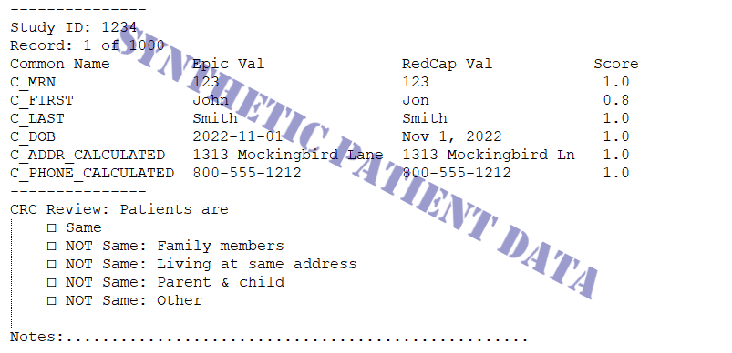

# REDCapMatchResolver 

[](https://github.com/psf/black)


---

**Documentation**: [https://github.com/DBMI/REDCapMatchResolver](https://github.com/DBMI/REDCapMatchResolver)

**Source Code**: [https://github.com/DBMI/REDCapMatchResolver](https://github.com/DBMI/REDCapMatchResolver)

---
## Purpose
### Score Patient Matches
The REDCapMatchResolver library is used to match data from Epic and REDCap to see if they come from the same patient.

#### Creating the `MatchRecord` object for a pair of patients
The [`REDCapRefresh` code](https://github.com/DBMI/REDCapRefresh) queries both Epic and REDCap databases for matching patient information and creates a `MatchRecord` object for each dataframe row. The `MatchRecord` class uses a list of `CommonField` objects to keep track of the different names Epic and REDCap use for the same fields:

| Common name | Epic name | REDCap name |
| :---------- | :-------- | :---------- |
| C_ADDR_CALCULATED | E_ADDR_CALCULATED | R_ADDR_CALCULATED |
| C_DOB | BIRTH_DATE | dob |
| C_EMAIL | EMAIL_ADDRESS | email_address |
|| <p align="center"><b>Linking Epic, REDCap column names using `CommonField` objects</b></p> ||

#### Creating a `MatchVariable` for each common field
For each common field name, the `MatchRecord` object extracts the corresponding Epic value and REDCap value from the provided dataframe row and creates a `MatchVariable` object from the pair of strings, storing them in an internal dictionary `__record`. Each `MatchVariable` compares the two strings and assigns a `MatchQuality` enumerated variable to describe the quality of the match

| Name | Value | Example |
| :--- | ----: | :------ |
| IGNORED | -10 | <i>Either Epic or REDCap values in "ignored" list</i> |
| MATCHED_NOPE | -1 | "apple", "banana" |
| MATCHED_NULL | 0 | "", "" |
| MATCHED_EXACT | 1 | "apple", "apple" |
| MATCHED_CASE_INSENSITIVE | 2 | "apple", "Apple" |
| MATCHED_ALPHA_NUM | 3 | "apple", "apple@!" |
| MATCHED_SUBSTRING | 4 | "apple", "appletree" |
|| <p align="center"><b>`MatchQuality` enumeration</b></p> ||

Any `MatchQuality` > 0 is considered "good enough". The `MatchRecord.__score` property is computed by summing the number of common fields where the `MatchQuality` is "good enough".

#### Calculated values
When the [`REDCapRefresh` code](https://github.com/DBMI/REDCapRefresh) reads Epic data, it creates a new _calculated_ column called "E_ADDR_CALCULATED" from the first line of the address and the zip code. A similar column "R_ADDR_CALCULATED" is added to the retrieved REDCap data.

Within the `MatchRecord` class, further calculated columns are created for patient MRN, name and phone number and added to the `__record` dictionary.

##### Best MRN
The patient's Epic record might contain more than one Medical Record Number (MRN), under columns "MRN" and "MRN_HX". Each MRN is compared to the REDCap "mrn" column and the `MatchVariable` representing the best match entered into the `MatchRecord`'s dictionary under the key "C_MRN_CALCULATED".

##### Best name match
First the patient's Epic name (as concatenated last, first name) is compared to their REDCap name (again as last, first). If that match is judged "good enough", the resulting  `MatchVariable` is appended to the dictionary of `MatchVariable` objects (under the key "C_NAME_CALCULATED") contained in the `MatchRecord` object. However, if the Epic and REDCap names don't match, we compare the Epic "ALIAS" column with the REDCap name and put that `MatchVariable` in the dictionary.

##### Best phone match
Since the patient's Epic record contains home, work and mobile phone numbers but the REDCap record just has one phone number, we compare each Epic number to the single REDCap number and stop when there is a match. The resulting `MatchVariable` is then appended to the dictionary under the key "C_PHONE_CALCULATED". 

#### Ignored values
There are some cases where we don't want to count string matches toward the `MatchRecord` score. For example, two patients in a group home will have the same address and phone number, but that doesn't mean they're the same person. Accordingly, the [`REDCapRefresh` code](https://github.com/DBMI/REDCapRefresh) first reads a list of known facility addresses and phone numbers, then provides these lists when instantiating a `MatchRecordGenerator` object. It is this object's `.generate_match_record` method which actually creates the `MatchRecord` object for each dataframe row. When a `MatchVariable` object compares the Epic and REDCap values, it assigns a `MatchQuality` of `IGNORED` if either value is present in the provided facility list. `IGNORED` value pairs are not "good enough" and don't count toward the match score.

#### Bonus score
Some patient values are more significant and deserve more weight in assessing a match. The `MatchRecord` class assigns the fields "C_ADDR_CALCULATED", "C_DOB" and "C_+_NAME_CALCULATED" as _bonus_ fields. If all three match, the `score` is incremented by one. In this way, two patients with matching name, date of birth and address receive a score of 4 (meaning reliable match) instead of 3 (needs review).

### Select Best Appointment
We may have patients with multiple upcoming appointments.
We'd like to select each patient's "best" appointment for inclusion into REDCap, based on clinic location and appointment date.
The calling function (like [refresh_redcap_upcoming_appointments](https://github.com/DBMI/AoU_v2/blob/main/redcap/refresh_redcap_upcoming_appointments.py))
should instantiate a `REDCapClinic` object, which reads the Excel spreadsheet the CRCs have developed to assign a priority value
to each clinic. This `REDCapClinic` object is then provided each time a `REDCapPatient` class object is created, so that
the patient's `REDCapAppointment` objects contain not only clinic location, date and time, but a priority value as well.
Then, when `refresh_redcap_upcoming_appointments` creates the REDCap update, it calls
the `REDCapPatient` method `csv`, which in turn calls the `best_appointment` method to select the `REDCapAppointment` with the highest clinic priority.
In case there are more than one appointment at the best clinic, `best_appointment` selects the earliest appointment at that clinic.

### Resolve Ambiguous Patient Matches
When software identifies a pair of patient records (one REDCap and one Epic) that *might* refer to the same patient, the `REDCapReportWriter` class writes a human-readable, machine-parseable report showing potential patient matches that need review by
a human. Once someone has reviewed the patient info and have marked up the reports with their decisions, the `REDCapReportReader` class reads/parses the marked-up reports, producing a pandas DataFrame output. Finally, the `REDCapMatchResolver` class reads all the reviewed reports into a temporary database.
Its `lookup_potential_match` method allows external software to submit a block of text showing the patient information from both REDCap and Epic & see if a human reviewer has already made a decision whether these records are a match.

|       |
|------------------------------------------------------|
| <p align="center"><b>Example of Match Report</b></p> |


## Installation

```sh
pip install git+https://github.com/DBMI/REDCapMatchResolver.git
```

## Development

* Clone this repository
* Requirements:
  * [Poetry](https://python-poetry.org/)
  * Python 3.7+
* Create a virtual environment and install the dependencies

```sh
poetry install
```

* Activate the virtual environment

```sh
poetry shell
```

### Testing

```sh
pytest
```

### Documentation

The documentation is automatically generated from the content of the [docs directory](./docs) and from the docstrings
 of the public signatures of the source code. The documentation is updated and published as a [Github project page
 ](https://pages.github.com/) automatically as part each release.

### Releasing

Trigger the [Draft release workflow](https://github.com/DBMI/REDCapMatchResolver/actions/workflows/draft_release.yml)
(press _Run workflow_). This will update the changelog & version and create a GitHub release which is in _Draft_ state.

Find the draft release from the
[GitHub releases](https://github.com/DBMI/REDCapMatchResolver/releases) and publish it. When
 a release is published, it'll trigger [release](https://github.com/DBMI/REDCapMatchResolver/blob/master/.github/workflows/release.yml) workflow which creates PyPI
 release and deploys updated documentation.

### Pre-commit

Pre-commit hooks run all the auto-formatters (e.g. `black`, `isort`), linters (e.g. `mypy`, `flake8`), and other quality
 checks to make sure the changeset is in good shape before a commit/push happens.

You can install the hooks with (runs for each commit):

```sh
pre-commit install
```

Or if you want them to run only for each push:

```sh
pre-commit install -t pre-push
```

Or if you want e.g. want to run all checks manually for all files:

```sh
pre-commit run --all-files
```

---

This project was generated using the [python-package-cookiecutter](https://github.com/DBMI/python-package-cookiecutter) template, modeled on the [wolt-python-package-cookiecutter](https://github.com/woltapp/wolt-python-package-cookiecutter) template.
